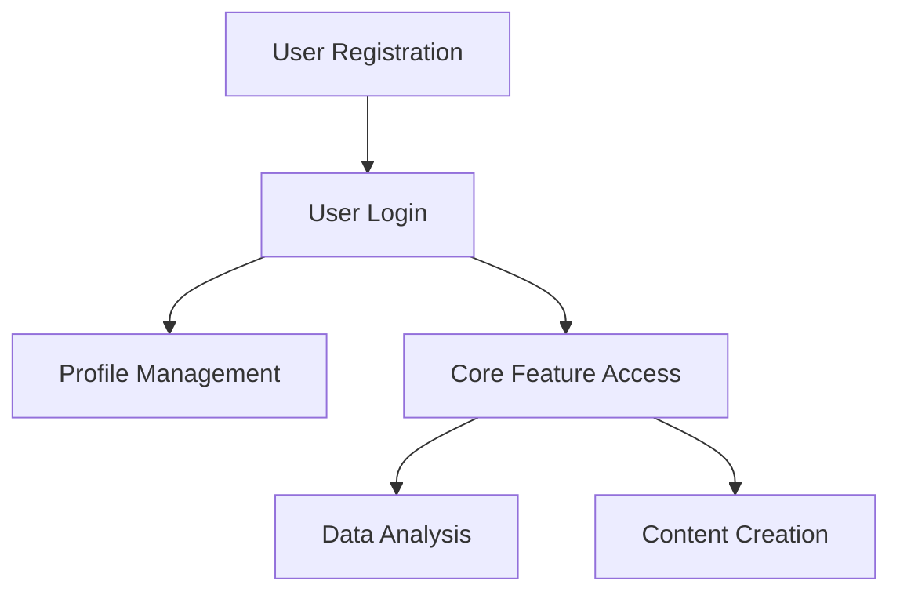
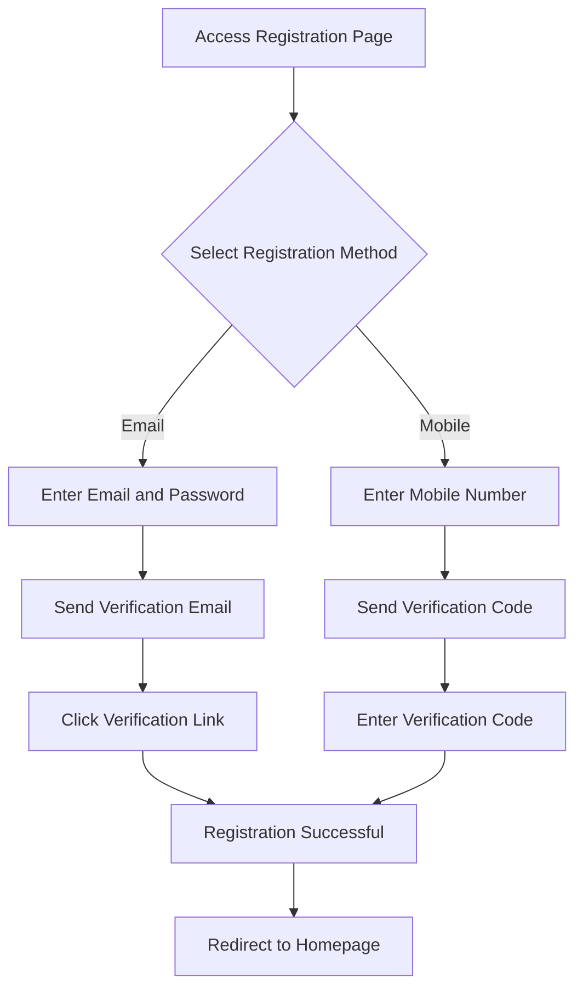
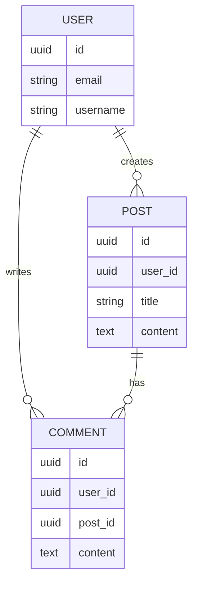

# Product Requirements Document (PRD)

> **Document Version**: v1.0  
> **Creation Date**: YYYY-MM-DD  
> **Last Updated**: YYYY-MM-DD  
> **Document Status**: ⏳ Draft / 📝 In Review / ✅ Approved  
> **Owner**: [Name]  
> **Reviewers**: [List of Names]

---

## 📋 Document Revision History

| Version | Date | Revised By | Revision Description |
|---------|------|------------|----------------------|
| v1.0 | YYYY-MM-DD | [Name] | Initial Version |
| v1.1 | YYYY-MM-DD | [Name] | [Revision Description] |

---

## 1. Product Overview

### 1.1 Product Background

**Market Situation**:
- [Describe current market conditions, pain points, and opportunities]

**Target Users**:
- **Primary User Group**: [Describe core user persona]
- **Secondary User Group**: [Describe secondary user persona]

**Business Value**:
- [Explain the value and significance of the product to the business]

### 1.2 Product Positioning

**Product Vision**:
- [One-sentence description of the product's long-term vision]

**Product Positioning**:
- [Clearly define what the product is, who it serves, and what problem it solves]

**Core Competitiveness**:
- [List the product's core differentiating advantages]

### 1.3 Product Goals

**Business Goals**:
- [e.g., Acquire 10,000 users within 3 months]
- [e.g., Increase conversion rate to 15%]

**Product Goals**:
- [e.g., Implement core MVP features]
- [e.g., Achieve user satisfaction score of 4.5/5.0]

---

## 2. User Analysis

### 2.1 Target User Personas

#### User Persona 1: [Persona Name]
- **Demographic Characteristics**:
  - Age: [Age Range]
  - Occupation: [Occupation Type]
  - Income Level: [Income Range]
  - Location: [Geographic Location]

- **Behavioral Characteristics**:
  - Usage Scenarios: [When and where they use it]
  - Usage Frequency: [DAU/WAU/MAU]
  - Technical Proficiency: [Beginner/Intermediate/Advanced]

- **Pain Points and Needs**:
  - Core Pain Point: [Most significant problem]
  - Expected Value: [What they hope to gain]
  - Motivation: [Why they use this product]

#### User Persona 2: [Persona Name]
(Same structure as above)

### 2.2 User Journey Map

```
[User Scenario] → [Touchpoint 1] → [Touchpoint 2] → [Touchpoint 3] → [Expected Result]
```

**Example**:
```
New User Registration → Complete Profile → First Experience with Core Feature → Gain Value → Become Active User
```

---

## 3. Functional Requirements

### 3.1 Function Priority Definition

| Priority | Description | Symbol |
|----------|-------------|--------|
| P0 | Core function, must be included in MVP | 🔴 |
| P1 | Important function, should be included in first version | 🟡 |
| P2 | Secondary function, can be added in later versions | 🟢 |
| P3 | Nice-to-have, long-term planning | ⚪ |

### 3.2 Feature List

#### 3.2.1 User Authentication and Authorization Module 🔴

**Requirement ID**: REQ-001  
**Priority**: P0  
**Status**: ⏳ To be developed

**User Story**:
```
As a [User Persona]
I want to [Perform an action]
So that [Achieve a goal]
```

**Feature Description**:
- [Detailed description of the function's purpose and implementation]

**Functional Points**:
- [ ] **User Registration**:
  - Support email registration
  - Support mobile number registration
  - Support third-party login (WeChat, Google)
  - Email/Mobile verification
  
- [ ] **User Login**:
  - Account and password login
  - Mobile verification code login
  - Third-party login
  - Remember login state (7 days)
  
- [ ] **Password Management**:
  - Forgot password reset
  - Change password
  - Password strength validation (at least 8 characters, including uppercase, lowercase, and numbers)

**Acceptance Criteria**:
- ✅ User can complete the registration process within 30 seconds
- ✅ Login success rate > 99%
- ✅ Support 1000+ concurrent login requests
- ✅ Passwords stored using encryption (BCrypt)
- ✅ Lock account for 15 minutes after 5 failed login attempts

**Dependencies**:
- Email Service (SendGrid/Aliyun Mail)
- SMS Service (Tencent Cloud/Aliyun SMS)
- OAuth 2.0 Service Integration

**Notes**:
- Must comply with GDPR data protection requirements
- Sensitive operations require two-factor authentication

---

#### 3.2.2 [Functional Module Name] 🟡

**Requirement ID**: REQ-002  
**Priority**: P1  
**Status**: ⏳ To be developed

(Fill in according to the above structure)

---

#### 3.2.3 [Functional Module Name] 🟢

**Requirement ID**: REQ-003  
**Priority**: P2  
**Status**: ⏳ To be developed

(Fill in according to the above structure)

---

### 3.3 Functional Dependency Diagram



---

## 4. Non-Functional Requirements

### 4.1 Performance Requirements

| Metric | Requirement | Priority |
|--------|-------------|----------|
| Page Load Time | < 2s (First screen) < 1s (Subsequent) | P0 |
| API Response Time | 95% requests < 200ms | P0 |
| Concurrent Users | Support 10,000+ simultaneous online users | P1 |
| System Availability | 99.9% SLA (Monthly) | P0 |
| Database Query | 95% queries < 100ms | P1 |

### 4.2 Security Requirements

- [ ] **Data Security**:
  - Encrypted storage for sensitive data (AES-256)
  - Transport layer encryption (HTTPS/TLS 1.3)
  - Database connection encryption
  
- [ ] **Access Control**:
  - Role-Based Access Control (RBAC)
  - API access token mechanism (JWT)
  - Prevent SQL injection, XSS, CSRF attacks
  
- [ ] **Audit and Logging**:
  - Audit logs for key operations
  - Anomalous access alerts
  - 90-day log retention

### 4.3 Usability Requirements

- [ ] **Multi-platform Support**:
  - Web (Chrome, Firefox, Safari, Edge)
  - Mobile (iOS 13+, Android 9+)
  - Responsive design (Adapts from 320px to 2560px)
  
- [ ] **Accessibility**:
  - Comply with WCAG 2.1 AA standards
  - Support keyboard navigation
  - Support screen readers

### 4.4 Scalability Requirements

- [ ] Support Horizontal Scaling
- [ ] Database read-write separation
- [ ] Caching layer design (Redis)
- [ ] CDN acceleration for static resources

### 4.5 Compatibility Requirements

| Platform | Version Requirements |
|----------|----------------------|
| Web Browser | Chrome 90+, Firefox 88+, Safari 14+, Edge 90+ |
| iOS | iOS 13+ |
| Android | Android 9.0+ |
| Backend Environment | [e.g., Python 3.11+] |

### 4.6 Compliance Requirements

- [ ] GDPR (General Data Protection Regulation)
- [ ] CCPA (California Consumer Privacy Act)
- [ ] [Regional: e.g., Cybersecurity Law, Data Security Law, PIPL]

---

## 5. User Interface Requirements

### 5.1 Interface Prototypes

**Main Page List**:
1. Login/Register Page
2. Home/Dashboard
3. [Functional Page 1]
4. [Functional Page 2]
5. Profile Settings Page

**Prototype Link**:
- Figma: [Link]
- Or insert screenshots of key pages here

### 5.2 Interaction Flow

**Core Flow 1: User Registration Flow**



### 5.3 UI/UX Design Principles

- **Simplicity**: Reduce cognitive load, maximum 3 main actions per screen
- **Consistency**: Unified design language and interaction patterns
- **Feedback**: Clear visual feedback for every action
- **Error Tolerance**: Provide undo/redo functions, double-confirmation for destructive actions

---

## 6. Data Requirements

### 6.1 Core Data Entities

#### User Entity (User)

| Field Name | Type | Required | Description |
|------------|------|----------|-------------|
| id | UUID | Yes | Unique User ID |
| email | String | Yes | Email (Unique) |
| phone | String | No | Phone Number (Unique) |
| password_hash | String | Yes | Password Hash |
| username | String | Yes | Username (Unique) |
| avatar_url | String | No | Avatar URL |
| role | Enum | Yes | Role (user/admin) |
| status | Enum | Yes | Status (active/inactive/banned) |
| created_at | Datetime | Yes | Creation Time |
| updated_at | Datetime | Yes | Update Time |

(Add other core entities)

### 6.2 Data Relationship Diagram



### 6.3 Data Volume Estimation

| Data Type | Initial (3 months) | 6 months | 1 year |
|-----------|--------------------|----------|--------|
| Users | 10,000 | 50,000 | 100,000 |
| DAU | 2,000 | 10,000 | 20,000 |
| Daily New Data | 1,000 records | 5,000 records | 10,000 records |
| Storage Space | 10 GB | 50 GB | 100 GB |

---

## 7. Business Rules

### 7.1 Core Business Logic

#### Rule 1: User Level System
- New User: 0-100 points
- Active User: 101-500 points
- Premium User: 501+ points
- Point Earning Rules:
  - Daily Login: +5 points
  - Post Content: +10 points
  - Content Liked: +1 point

#### Rule 2: Content Moderation Mechanism
- User-posted content automatically enters moderation queue
- AI Initial Screening: Sensitive word filtering, image recognition
- Manual Review: Suspicious content reviewed by humans
- Moderation Efficiency: 95% of content reviewed within 1 hour

### 7.2 Exception Handling Rules

| Exception Scenario | Handling Method |
|--------------------|-----------------|
| Duplicate Registration | Prompt "Email/Mobile already registered", guide to login or password recovery |
| Payment Failure | Retry 3 times; if it still fails, prompt user and save order for later payment |
| Network Timeout | Client retry 2 times; if it still fails, prompt user to check network |
| Server Error | Log error, return friendly error message, trigger alert notification |

---

## 8. Operational Requirements

### 8.1 Data Statistics Requirements

**Must-Track Key Metrics**:
- DAU/MAU (Daily/Monthly Active Users)
- User Retention Rate (Day 1, 7, 30)
- Conversion Funnel (Register → Activate → Retain → Pay)
- User Behavior Paths
- Feature Usage Frequency

### 8.2 Operational Feature Requirements

- [ ] Admin Dashboard (Content Management, User Management, Data Statistics)
- [ ] Push Notifications (Email, SMS, App Push)
- [ ] Campaign Configuration (Coupons, Points Activities)
- [ ] A/B Testing Support

---

## 9. Project Constraints

### 9.1 Time Constraints

- **MVP Launch Date**: YYYY-MM-DD
- **Milestone Dates**:
  - Design Review Completed: YYYY-MM-DD
  - Development Completed: YYYY-MM-DD
  - Testing Completed: YYYY-MM-DD
  - Production Release: YYYY-MM-DD

### 9.2 Budget Constraints

- **Development Cost**: [Budget Amount]
- **Infrastructure Cost**: [Budget Amount]/month
- **Third-Party Service Cost**: [Budget Amount]/month

### 9.3 Technical Constraints

- Must use [Specified Tech Stack]
- Deployment Environment: [Cloud Platform/On-Premise]
- Database: [Specified Database]

### 9.4 Legal and Compliance Constraints

- Must comply with [Country/Region] laws and regulations
- User agreement and privacy policy must be ready before launch

---

## 10. Risk Assessment

| Risk Item | Severity | Probability | Impact | Mitigation Strategy |
|-----------|----------|-------------|--------|---------------------|
| Unstable Third-Party Service | High | Medium | Function Unavailable | Backup service provider plan |
| Data Security Vulnerability | High | Low | Data Breach | Security audits, penetration testing |
| Lower User Growth than Expected | Medium | High | Business Goal Failure | Product optimization, marketing |
| Development Delay | Medium | Medium | Delayed Launch | Realistic scheduling, resource addition |

---

## 11. Success Metrics

### 11.1 Product Metrics (KPI)

| Metric | Target Value | Measurement Method | Target Date |
|--------|--------------|--------------------|-------------|
| Registered Users | 10,000 | Google Analytics | 3 months |
| DAU | 2,000 | Backend Stats | 3 months |
| Retention Rate (Day 7) | 30% | Backend Stats | 3 months |
| NPS (Net Promoter Score) | 40+ | User Surveys | 6 months |
| Core Feature Usage | 60% | Backend Stats | 3 months |

### 11.2 Technical Metrics

| Metric | Target Value |
|--------|--------------|
| System Availability | 99.9% |
| API Response Time P95 | < 200ms |
| Error Rate | < 0.1% |
| Code Test Coverage | > 80% |

---

## 12. Roadmap

### Version v1.0 (MVP)
- [Core Feature List]

### Version v1.1
- [Planned New Features]
- Estimated Release: YYYY-MM-DD

### Version v2.0
- [Planned New Features]
- Estimated Release: YYYY-MM-DD

---

## 13. Appendix

### 13.1 Glossary

| Term | Definition |
|------|------------|
| MVP | Minimum Viable Product |
| DAU | Daily Active Users |
| MAU | Monthly Active Users |

### 13.2 References

- [Market Research Reports]
- [Competitor Analysis Document]
- [User Survey Results]

### 13.3 Related Document Links

- Technical Design Document (TDD): [Link]
- Test Document (Test): [Link]
- API Specification Document: [Link]

---

## 📝 Document Approval

| Role | Name | Approval Opinion | Date |
|------|------|------------------|------|
| Product Manager | [Name] | ✅ Approved / ⚠️ Conditional Approval / ❌ Rejected | YYYY-MM-DD |
| Tech Lead | [Name] | ✅ Approved / ⚠️ Conditional Approval / ❌ Rejected | YYYY-MM-DD |
| Project Manager | [Name] | ✅ Approved / ⚠️ Conditional Approval / ❌ Rejected | YYYY-MM-DD |

---

**End of Document**
