# Technical Design Document (TDD)

> **Document Version**: v1.0  
> **Creation Date**: YYYY-MM-DD  
> **Last Updated**: YYYY-MM-DD  
> **Document Status**: ⏳ Draft / 📝 In Review / ✅ Approved  
> **Tech Lead**: [Name]  
> **Reviewers**: [List of Names]

---

## 📋 Document Revision History

| Version | Date | Revised By | Revision Description |
|---------|------|------------|----------------------|
| v1.0 | YYYY-MM-DD | [Name] | Initial Version |
| v1.1 | YYYY-MM-DD | [Name] | [Revision Description] |

---

## 1. Overview

### 1.1 Project Background

**Business Background**:
- [Briefly describe business requirements and goals]

**Technical Goals**:
- [Explain the technical objectives this system aims to achieve]

**Related Documents**:
- PRD Document: [Link]
- API Specification: [Link]
- Architecture Document: [Link]

### 1.2 Design Principles

- **High Availability**: System availability reaches 99.9%
- **High Performance**: API response time P95 < 200ms
- **Scalability**: Support horizontal scaling to handle user growth
- **Maintainability**: Clear code structure, easy to maintain and iterate
- **Security**: Data encryption, defense against common security vulnerabilities
- **Testability**: Unit test coverage > 80%

### 1.3 Technology Selection Principles

- **Mature and Stable**: Prioritize tech stacks proven in production
- **Active Community**: Good community support and documentation
- **Team Familiarity**: Controllable learning cost or existing expertise
- **Performance First**: Meets performance requirements
- **Long-term Maintenance**: Avoid technologies nearing end-of-life

---

## 2. Tech Stack

### 2.1 Backend Tech Stack

| Category | Selection | Version | Purpose | Reason for Selection |
|----------|-----------|---------|---------|----------------------|
| Language | Python | 3.11+ | Business Logic | Rich ecosystem, high development efficiency |
| Web Framework | FastAPI | 0.104+ | API Service | High performance, native async support, auto-docs |
| ORM | SQLAlchemy | 2.0+ | DB Operations | Powerful, supports multiple databases |
| Async Library | asyncio / aiohttp | Built-in / 3.9+ | Async Ops | Native Python async support |
| Task Queue | Celery | 5.3+ | Async Tasks | Mature and stable, supports multiple brokers |
| Serialization | Pydantic | 2.4+ | Validation | Type safety, deep integration with FastAPI |

### 2.2 Frontend Tech Stack

| Category | Selection | Version | Purpose | Reason for Selection |
|----------|-----------|---------|---------|----------------------|
| Framework | React | 18.2+ | UI Development | Mature ecosystem, component-based |
| Language | TypeScript | 5.0+ | Type Safety | Improves code quality, reduces runtime errors |
| Build Tool | Vite | 4.5+ | Dev & Build | Fast dev server, optimized production build |
| State Management | Zustand | 4.4+ | Global State | Lightweight, easy to use |
| Routing | React Router | 6.18+ | Page Routing | Official library, full-featured |
| UI Library | Ant Design | 5.11+ | Components | Enterprise UI design, rich components |
| HTTP Client | Axios | 1.6+ | API Requests | Powerful, interceptor mechanism |
| Form Handling | React Hook Form | 7.48+ | Form Management | High performance, easy to use |

### 2.3 Database

| Database | Version | Purpose | Reason for Selection |
|----------|---------|---------|----------------------|
| PostgreSQL | 15+ | Primary DB | Powerful, JSON support, reliable transactions |
| Redis | 7.0+ | Cache, Session | High-performance in-memory database |
| Elasticsearch | 8.10+ | Full-text Search | Powerful search and analytics (Optional) |

### 2.4 Infrastructure

| Category | Selection | Version | Purpose |
|----------|-----------|---------|---------|
| Containerization | Docker | 24.0+ | App Containerization |
| Orchestration | Kubernetes | 1.28+ | Container Orchestration (Optional) |
| Web Server | Nginx | 1.24+ | Reverse Proxy, Load Balancing |
| Message Queue | RabbitMQ | 3.12+ | Message Middleware |
| Logging | ELK Stack | 8.10+ | Log Collection and Analysis |
| Monitoring | Prometheus + Grafana | Latest | System Monitoring |
| CI/CD | GitHub Actions | - | Continuous Integration/Deployment |

### 2.5 Third-Party Services

| Service Type | Provider | Purpose |
|--------------|----------|---------|
| Cloud Service | AWS / Aliyun / Azure | Server Hosting |
| Object Storage | AWS S3 / Aliyun OSS | File Storage |
| CDN | CloudFront / Aliyun CDN | Static Resource Acceleration |
| Email Service | SendGrid / Aliyun Mail | Email Sending |
| SMS Service | Twilio / Aliyun SMS | SMS Sending |
| Error Tracking | Sentry | Bug Tracking |
| APM | New Relic / Datadog | Performance Monitoring (Optional) |

---

## 3. System Architecture

### 3.1 High-Level Architecture


### 3.2 Architectural Pattern

**Pattern**: **Layered Architecture + Microservices (Optional)**

**Layers**:

1. **Presentation Layer**
   - Responsibility: UI, API Endpoints
   - Technology: React (Frontend), FastAPI (Backend API)

2. **Business Logic Layer**
   - Responsibility: Core business logic processing
   - Technology: Python Service Classes

3. **Data Access Layer**
   - Responsibility: DB operation encapsulation
   - Technology: SQLAlchemy ORM

4. **Infrastructure Layer**
   - Responsibility: Caching, Message Queue, External Service calls
   - Technology: Redis, RabbitMQ, Third-party API Clients

### 3.3 Deployment Architecture

**Production Architecture**:


**Environment Division**:
- **Development (Dev)**: Local or shared development servers
- **Testing (Test)**: Automated and manual testing
- **Staging**: Production mirror for final validation
- **Production**: Live environment serving real users

---

## 4. Core Module Design

### 4.1 Authentication and Authorization Module

**Status**: ⏳ To be implemented

#### 4.1.1 Module Overview

**Responsibilities**:
- User registration, login, logout
- Authentication
- Authorization (Permission control)
- Session management

**Technical Solution**:
- Authentication: JWT (JSON Web Token)
- Password Encryption: BCrypt
- Permission Model: RBAC (Role-Based Access Control)

#### 4.1.2 Class Diagram


#### 4.1.3 Core API Endpoints

| Endpoint | Method | Path | Description |
|----------|--------|------|-------------|
| User Register | POST | `/api/v1/auth/register` | New user registration |
| User Login | POST | `/api/v1/auth/login` | Login to obtain Token |
| Token Refresh | POST | `/api/v1/auth/refresh` | Refresh access token |
| User Logout | POST | `/api/v1/auth/logout` | Logout and invalidate Token |
| Current User | GET | `/api/v1/auth/me` | Get current logged-in user info |

#### 4.1.4 Authentication Flow


#### 4.1.5 Data Model

**User Table**:

```sql
CREATE TABLE users (
    id UUID PRIMARY KEY DEFAULT gen_random_uuid(),
    email VARCHAR(255) UNIQUE NOT NULL,
    phone VARCHAR(20) UNIQUE,
    password_hash VARCHAR(255) NOT NULL,
    username VARCHAR(50) UNIQUE NOT NULL,
    avatar_url TEXT,
    role_id UUID REFERENCES roles(id),
    status VARCHAR(20) DEFAULT 'active',
    email_verified BOOLEAN DEFAULT FALSE,
    phone_verified BOOLEAN DEFAULT FALSE,
    last_login_at TIMESTAMP,
    created_at TIMESTAMP DEFAULT CURRENT_TIMESTAMP,
    updated_at TIMESTAMP DEFAULT CURRENT_TIMESTAMP
);

CREATE INDEX idx_users_email ON users(email);
CREATE INDEX idx_users_username ON users(username);
```

**Role Table**:

```sql
CREATE TABLE roles (
    id UUID PRIMARY KEY DEFAULT gen_random_uuid(),
    name VARCHAR(50) UNIQUE NOT NULL,
    description TEXT,
    created_at TIMESTAMP DEFAULT CURRENT_TIMESTAMP
);
```

**Permission Table**:

```sql
CREATE TABLE permissions (
    id UUID PRIMARY KEY DEFAULT gen_random_uuid(),
    name VARCHAR(100) UNIQUE NOT NULL,
    resource VARCHAR(100) NOT NULL,
    action VARCHAR(50) NOT NULL,
    description TEXT,
    created_at TIMESTAMP DEFAULT CURRENT_TIMESTAMP
);
```

**Role_Permission Table**:

```sql
CREATE TABLE role_permissions (
    role_id UUID REFERENCES roles(id) ON DELETE CASCADE,
    permission_id UUID REFERENCES permissions(id) ON DELETE CASCADE,
    PRIMARY KEY (role_id, permission_id)
);
```

#### 4.1.6 Security Measures

- **Password Storage**: BCrypt hash, salt rounds 12
- **Token Security**:
  - Access Token Validity: 15 minutes
  - Refresh Token Validity: 7 days
  - Refresh Token stored in Redis, supports revocation
- **Brute Force Protection**: Lock account for 15 minutes after 5 failed attempts
- **HTTPS**: All APIs must be accessed via HTTPS
- **CORS**: Strict cross-origin policy configuration

---

### 4.2 [Business Module 2]

**Status**: ⏳ To be implemented

(Continue describing other core modules according to the above structure)

---

## 5. Database Design

### 5.1 Database Selection

**Primary DB**: PostgreSQL 15+

**Reasons**:
- Supports complex queries and transactions
- JSONB support for semi-structured data
- Rich index types (B-Tree, GIN, GiST)
- Powerful ecosystem (PostGIS, pg_trgm)

### 5.2 Database Architecture

**Pattern**: Master-Slave Replication

```
[Primary] --Async Replication--> [Replica 1]
          --Async Replication--> [Replica 2]
```

**Read-Write Separation**:
- Write Ops: Primary
- Read Ops: Replicas (via middleware or app routing)

### 5.3 ER Diagram

```mermaid
erDiagram
    USER ||--o{ POST : creates
    USER ||--o{ COMMENT : writes
    USER }|--|| ROLE : has
    ROLE ||--o{ PERMISSION : grants
    POST ||--o{ COMMENT : has
    POST }o--o{ TAG : tagged_with
    
    USER {
        uuid id PK
        string email UK
        string username UK
        string password_hash
        uuid role_id FK
        timestamp created_at
    }
    
    ROLE {
        uuid id PK
        string name UK
        string description
    }
    
    PERMISSION {
        uuid id PK
        string name UK
        string resource
        string action
    }
    
    POST {
        uuid id PK
        uuid user_id FK
        string title
        text content
        string status
        timestamp published_at
        timestamp created_at
    }
    
    COMMENT {
        uuid id PK
        uuid user_id FK
        uuid post_id FK
        text content
        timestamp created_at
    }
    
    TAG {
        uuid id PK
        string name UK
        int usage_count
    }
```



### 5.4 Detailed Table Design

**Full DDL see Appendix A**

### 5.5 Indexing Strategy

| Table | Column(s) | Index Type | Purpose |
|-------|-----------|------------|---------|
| users | email | B-Tree (Unique) | Login queries |
| users | username | B-Tree (Unique) | Username queries |
| users | created_at | B-Tree | Sort by registration |
| posts | user_id | B-Tree | Query user's posts |
| posts | status, published_at | B-Tree (Composite) | Published posts list |
| posts | title | GIN (Full-text) | Title search |
| comments | post_id, created_at | B-Tree (Composite) | Post comments query |

### 5.6 Sharding Strategy

**Sharding Plan** (when data grows beyond single-machine limits):

- **Horizontal Sharding**: Hash by `user_id`
- **Shard Count**: 4 shards initially, expandable to 16
- **Shard Key**: `user_id`
- **Middleware**: Citus / Vitess (Optional)

### 5.7 Backup and Recovery

**Backup Strategy**:
- **Full Backup**: Daily at 02:00
- **Incremental Backup**: Hourly WAL archiving
- **Retention**: Full for 30 days, incremental for 7 days
- **Storage**: Object storage (S3/OSS)

**Recovery Strategy**:
- **RTO (Recovery Time Objective)**: < 1 hour
- **RPO (Recovery Point Objective)**: < 5 minutes

---

## 6. API Design

### 6.1 Design Principles

- **RESTful**: Standard HTTP methods (GET, POST, PUT, DELETE)
- **Versioning**: URL versioning (`/api/v1/`)
- **Unified Response**: Consistent JSON format
- **Error Handling**: Standard HTTP status codes with detailed messages
- **Pagination**: List endpoints support pagination (limit/offset or cursor)
- **Filtering & Sorting**: Query parameters for filtering and sorting
- **Idempotency**: PUT and DELETE operations are idempotent

### 6.2 Base Path

```
https://api.example.com/api/v1/
```

### 6.3 Unified Response Format

**Success**:

```json
{
  "code": 0,
  "message": "Success",
  "data": {
    // Actual data
  },
  "timestamp": "2024-01-01T12:00:00Z"
}
```

**Error**:

```json
{
  "code": 400001,
  "message": "Invalid email format",
  "errors": [
    {
      "field": "email",
      "message": "Email must be a valid email address"
    }
  ],
  "timestamp": "2024-01-01T12:00:00Z"
}
```

### 6.4 Error Codes

| Code | HTTP Status | Description |
|------|-------------|-------------|
| 0 | 200 | Success |
| 400001 | 400 | Bad Request (Param error) |
| 401001 | 401 | Unauthorized (Invalid Token) |
| 403001 | 403 | Forbidden (No Permission) |
| 404001 | 404 | Not Found |
| 409001 | 409 | Conflict (e.g., Email exists) |
| 429001 | 429 | Too Many Requests |
| 500001 | 500 | Internal Server Error |

### 6.5 Detailed API Design

**See: API Specification Document (api-spec-template.md)**

---

## 7. Caching Design

### 7.1 Caching Strategy

**Cache Layers**:

1. **Browser Cache**: Static resources (images, CSS, JS)
2. **CDN Cache**: Static resources, partial API responses
3. **Application Cache (Redis)**:
   - User Sessions
   - Hot Data (Trending posts, user profiles)
   - Counters (Likes, comments)
4. **DB Query Cache**: PostgreSQL built-in query cache

### 7.2 Redis Use Cases

| Scenario | Data Structure | Key Naming | TTL |
|----------|----------------|------------|-----|
| User Session | Hash | `session:{user_id}` | 30m (Sliding) |
| User Profile | Hash | `user:{user_id}` | 1h |
| Post Detail | String (JSON) | `post:{post_id}` | 5m |
| Post List | List | `posts:list:{page}` | 1m |
| Like Count | String | `post:{post_id}:likes` | Persistent (Sync to DB) |
| Verification Code | String | `code:{phone/email}` | 5m |
| API Rate Limit | String | `ratelimit:{user_id}:{endpoint}` | 1m |

### 7.3 Cache Update Strategy

**Cache-Aside Pattern**:

1. Read:
   - Check cache; if hit, return
   - If miss, query DB, write to cache, then return

2. Update:
   - Update DB first
   - Then delete cache (not update)

**Write-Through Pattern** (for counters):
- Write to both cache and DB
- Periodic batch sync to DB to reduce write pressure

### 7.4 Protection against Penetration, Breakdown, and Avalanche

**Cache Penetration** (Querying non-existent data):
- Solution: Bloom filters + Cache null values (short TTL)

**Cache Breakdown** (Hot data expiry):
- Solution: Mutex locks + Hot data never expires

**Cache Avalanche** (Mass expiry):
- Solution: Randomize TTLs + Service degradation

---

## 8. Security Design

### 8.1 Auth & Auth

- **Authentication**: JWT Token
- **Authorization**: RBAC
- **Token Security**: Short-lived Access Token + Long-lived Refresh Token

### 8.2 Data Security

**Transport Security**:
- Enforce HTTPS/TLS 1.3
- Disable weak ciphers

**Storage Security**:
- Password: BCrypt hash (cost 12)
- Sensitive Data: AES-256 encrypted
- DB Connection: Encrypted connection strings

**Data Masking**:
- No sensitive info in logs (passwords, tokens, phones)
- Mask sensitive info in UI (phone numbers, emails)

### 8.3 Defense against Common Attacks

**SQL Injection**:
- Use ORM parameterized queries
- Forbidden raw SQL concatenation

**XSS**:
- Input validation and output escaping
- Content-Security-Policy headers

**CSRF**:
- CSRF Token validation
- SameSite Cookie attribute

**Clickjacking**:
- X-Frame-Options: DENY

**DDoS Protection**:
- API rate limiting (100 req/min per user)
- CDN protection
- IP Blacklisting

### 8.4 API Security

**Rate Limiting**:
- **Global**: 10,000 QPS
- **Per User**: 100 req/min
- **Sensitive (e.g., Login)**: 5 req/min

**API Signing** (Inter-service calls):
- HMAC-SHA256 signature
- Timestamp to prevent replay attacks

### 8.5 Logging & Auditing

**Security Logs**:
- Login/Logout logs
- Permission change logs
- Sensitive operation logs (deletion, critical updates)

**Retention**:
- App Logs: 30 days
- Security Audit Logs: 90 days

---

## 9. Performance Optimization

### 9.1 Performance Metrics

| Metric | Target Value |
|--------|--------------|
| API Latency (P50) | < 100ms |
| API Latency (P95) | < 200ms |
| API Latency (P99) | < 500ms |
| DB Query Latency (P95) | < 50ms |
| Page First Paint | < 2s |
| Page Fully Loaded | < 4s |
| Concurrent Users | 10,000+ |
| QPS | 10,000+ |

### 9.2 Backend Optimization

**Database**:
- Proper indexing
- Avoid N+1 queries (use JOIN or prefetching)
- Slow query monitoring and optimization (> 100ms)
- Read-write separation

**Caching**:
- Hot data caching
- Query result caching
- Computation result caching

**Async Processing**:
- Time-consuming tasks (emails, file processing) moved to background
- Decoupling with message queues

**Connection Pooling**:
- DB Connection Pool (Min 10, Max 100)
- Redis Connection Pool (Min 5, Max 50)

### 9.3 Frontend Optimization

**Resource Optimization**:
- Code Splitting
- Lazy Loading
- Tree Shaking
- Image Optimization (WebP, lazy loading, responsive images)

**Caching**:
- Static resource versioning (File hash)
- Browser caching (Cache-Control)
- Service Worker offline cache

**Rendering**:
- SSR (Server-Side Rendering) - Optional
- Virtual Scrolling for long lists
- Debounce and Throttle

---

## 10. Scalability Design

### 10.1 Horizontal Scaling

**Stateless Design**:
- App servers are stateless (Sessions in Redis)
- Support multi-instance deployment
- Load balancer distributes traffic

**Database Scaling**:
- Read-write separation
- Read replicas for scaling read traffic
- Vertical scaling for primary DB
- Sharding for massive data

---

## 11. Monitoring and Observability

### 11.1 Monitoring

- **Infrastructure**: CPU, Memory, Disk, Network
- **Database**: QPS, Latency, Connection Count, Buffer Cache Hit Ratio
- **Application**: QPS, Error Rate, Response Time, Thread Pool Status
- **Business**: Registration Count, Active Users, Order Volume

### 11.2 Logging

- **Format**: Structured JSON
- **Collection**: Filebeat -> Logstash -> Elasticsearch
- **Visualization**: Grafana / Kibana
- **Alerting**: Alertmanager (based on error rate or latency)

### 11.3 Tracing

- **Tool**: Jaeger / Zipkin (Optional)
- **Coverage**: Full request lifecycle across services

---

## 12. Deployment and CI/CD

### 12.1 CI/CD Pipeline

1. **Code Commit**: Push to branch
2. **Lint & Test**: Run static analysis and unit tests
3. **Build**: Docker image build
4. **Deploy to Test**: Deploy to Test environment
5. **Integration Test**: Run automated integration tests
6. **Deploy to Staging**: Manual approval for Staging
7. **Deploy to Prod**: Blue-Green or Canary deployment

---

## 13. Appendix

### 13.1 Glossary

| Term | Definition |
|------|------------|
| TDD | Technical Design Document |
| JWT | JSON Web Token |
| RBAC | Role-Based Access Control |
| ORM | Object-Relational Mapping |

### 13.2 References

- [Related Tech Docs]
- [Architecture Decision Records]

---

**End of Document**
