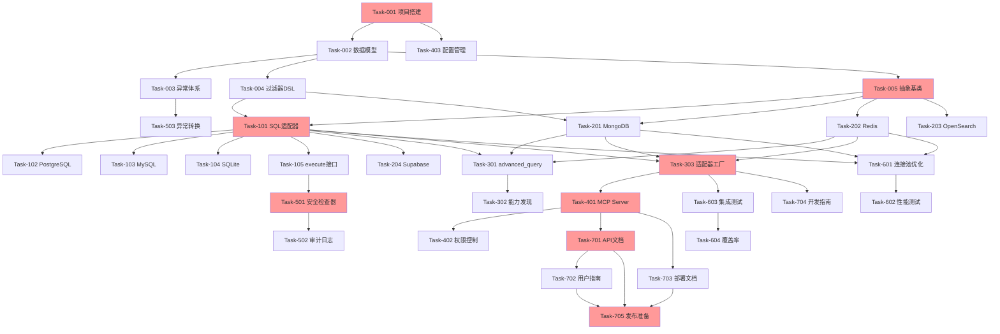

# 任务开发清单 (Task List)

**项目名称**: MCP Database SDK  
**版本**: v1.0  
**创建日期**: 2024-01-07  
**文档状态**: ⏳ 待评审

---

## 1. 任务优先级说明

| 优先级 | 说明 | 标识 |
|--------|------|------|
| P0 | 关键任务，阻塞后续开发 | 🔴 |
| P1 | 重要任务，核心功能 | 🟠 |
| P2 | 次要任务，增强功能 | 🟡 |
| P3 | 可选任务，优化改进 | 🟢 |

---

## 2. Phase 1: 项目基础搭建 (Week 1)

### Task-001: 项目脚手架搭建 🔴 ⏳ 待开发
**优先级**: P0  
**预估工时**: 4 小时  
**前置依赖**: 无

**任务描述**:
搭建项目基础结构，配置开发环境。

**具体工作**:
1. 创建项目目录结构
2. 配置 `pyproject.toml`
3. 配置 `ruff`, `mypy`, `pytest`
4. 设置 `.gitignore` 和 `.env.example`
5. 创建 README.md

**验收标准**:
- ✅ 项目结构符合 TDD 设计
- ✅ 依赖管理工具可用 (poetry/pip)
- ✅ 代码检查工具配置正确
- ✅ 可以运行 `pytest` (即使没有测试)

**交付物**:
- 完整的项目结构
- 配置文件
- README.md

---

### Task-002: 核心数据模型定义 🔴 ⏳ 待开发
**优先级**: P0  
**预估工时**: 6 小时  
**前置依赖**: Task-001

**任务描述**:
使用 Pydantic 定义所有核心数据模型。

**具体工作**:
1. 定义 Result 模型 (InsertResult, QueryResult, etc.)
2. 定义 Capability 模型
3. 定义 DatabaseConfig 模型
4. 定义异常类层次结构
5. 编写单元测试

**验收标准**:
- ✅ 所有模型有完整类型注解
- ✅ 模型验证逻辑正确
- ✅ 单元测试覆盖率 > 90%
- ✅ mypy 类型检查通过

**交付物**:
- `src/mcp_database/core/models.py`
- `src/mcp_database/core/exceptions.py`
- `tests/test_models.py`

---

### Task-003: 异常体系实现 🔴 ⏳ 待开发
**优先级**: P0  
**预估工时**: 4 小时  
**前置依赖**: Task-002

**任务描述**:
实现统一异常体系和异常转换器。

**具体工作**:
1. 实现 DatabaseError 基类
2. 实现具体异常类
3. 实现 ExceptionTranslator
4. 编写异常转换测试

**验收标准**:
- ✅ 所有异常继承自 DatabaseError
- ✅ 异常信息包含原始错误
- ✅ 转换器能正确映射常见错误
- ✅ 测试覆盖主要异常场景

**交付物**:
- `src/mcp_database/core/exceptions.py` (完善)
- `tests/test_exceptions.py`

---

### Task-004: 过滤器 DSL 解析器 🔴 ⏳ 待开发
**优先级**: P0  
**预估工时**: 8 小时  
**前置依赖**: Task-002

**任务描述**:
实现过滤器 DSL 的解析和转换逻辑。

**具体工作**:
1. 实现 FilterParser 基类
2. 实现 SQLFilterTranslator
3. 实现 MongoFilterTranslator
4. 实现 RedisFilterTranslator
5. 编写全面的单元测试

**验收标准**:
- ✅ 支持所有 PRD 定义的操作符
- ✅ SQL 转换正确生成 WHERE 子句
- ✅ MongoDB 转换正确生成 `$` 操作符
- ✅ 复杂嵌套逻辑正确处理
- ✅ 测试覆盖率 > 85%

**交付物**:
- `src/mcp_database/core/filters.py`
- `tests/test_filters.py`

---

### Task-005: DatabaseAdapter 抽象基类 🔴 ⏳ 待开发
**优先级**: P0  
**预估工时**: 4 小时  
**前置依赖**: Task-002

**任务描述**:
定义 DatabaseAdapter 抽象基类。

**具体工作**:
1. 定义抽象方法签名
2. 实现通用辅助方法
3. 定义 `get_capabilities()` 接口
4. 编写接口文档

**验收标准**:
- ✅ 所有 CRUD 方法都是抽象方法
- ✅ 方法签名与 TDD 一致
- ✅ 类型注解完整
- ✅ 文档字符串清晰

**交付物**:
- `src/mcp_database/core/adapter.py`
- 接口文档

---

## 3. Phase 2: SQL 数据库支持 (Week 1-2)

### Task-101: SQL 适配器基础实现 🔴 ⏳ 待开发
**优先级**: P0  
**预估工时**: 12 小时  
**前置依赖**: Task-005, Task-004

**任务描述**:
实现 SQLAdapter 基类，支持 SQLAlchemy。

**具体工作**:
1. 实现连接管理 (connect/disconnect)
2. 实现 insert 方法
3. 实现 query 方法
4. 实现 update 方法
5. 实现 delete 方法
6. 实现过滤器转换集成
7. 编写单元测试

**验收标准**:
- ✅ 支持异步操作
- ✅ 连接池正确配置
- ✅ 所有 CRUD 方法可用
- ✅ 过滤器正确转换
- ✅ 测试覆盖率 > 80%

**交付物**:
- `src/mcp_database/adapters/sql/base.py`
- `tests/test_adapters/test_sql_base.py`

---

### Task-102: PostgreSQL 支持 🔴 ⏳ 待开发
**优先级**: P0  
**预估工时**: 6 小时  
**前置依赖**: Task-101

**任务描述**:
实现 PostgreSQL 特化适配器。

**具体工作**:
1. 配置 asyncpg 驱动
2. 实现 PostgreSQL 特定优化
3. 编写集成测试
4. 测试连接池配置

**验收标准**:
- ✅ 连接正常建立
- ✅ CRUD 操作通过测试
- ✅ URL 参数正确解析
- ✅ 连接池参数生效

**交付物**:
- `src/mcp_database/adapters/sql/postgresql.py`
- `tests/integration/test_postgresql.py`

---

### Task-103: MySQL 支持 🟠 ⏳ 待开发
**优先级**: P1  
**预估工时**: 6 小时  
**前置依赖**: Task-101

**任务描述**:
实现 MySQL 适配器。

**具体工作**:
1. 配置 aiomysql 驱动
2. 处理 MySQL 特定语法差异
3. 编写集成测试

**验收标准**:
- ✅ 基础 CRUD 可用
- ✅ 连接池正常工作
- ✅ 通过集成测试

**交付物**:
- `src/mcp_database/adapters/sql/mysql.py`
- `tests/integration/test_mysql.py`

---

### Task-104: SQLite 支持 🟠 ⏳ 待开发
**优先级**: P1  
**预估工时**: 4 小时  
**前置依赖**: Task-101

**任务描述**:
实现 SQLite 文件数据库支持。

**具体工作**:
1. 配置 aiosqlite 驱动
2. 处理文件路径解析
3. 编写单元测试

**验收标准**:
- ✅ 文件数据库创建正常
- ✅ 异步文件 I/O 正常
- ✅ 基础 CRUD 可用

**交付物**:
- `src/mcp_database/adapters/sql/sqlite.py`
- `tests/test_adapters/test_sqlite.py`

---

### Task-105: SQL execute 接口实现 🟠 ⏳ 待开发
**优先级**: P1  
**预估工时**: 8 小时  
**前置依赖**: Task-101

**任务描述**:
实现 execute 接口及安全检查。

**具体工作**:
1. 实现 execute 方法
2. 集成 SQLSecurityChecker
3. 实现参数化查询验证
4. 实现危险命令拦截
5. 编写安全测试

**验收标准**:
- ✅ 参数化查询正常执行
- ✅ 非参数化查询被拒绝
- ✅ 危险命令被拦截
- ✅ 安全测试通过

**交付物**:
- `src/mcp_database/core/security.py`
- `tests/test_security.py`

---

## 4. Phase 3: NoSQL 数据库支持 (Week 3-4)

### Task-201: MongoDB 适配器 🔴 ⏳ 待开发
**优先级**: P0  
**预估工时**: 10 小时  
**前置依赖**: Task-005, Task-004

**任务描述**:
实现 MongoDB 文档数据库适配器。

**具体工作**:
1. 配置 Motor 驱动
2. 实现 CRUD 方法
3. 实现过滤器转换
4. 编写集成测试

**验收标准**:
- ✅ 异步操作正常
- ✅ 过滤器转换正确
- ✅ 支持 MongoDB 特有类型
- ✅ 集成测试通过

**交付物**:
- `src/mcp_database/adapters/nosql/mongodb.py`
- `tests/integration/test_mongodb.py`

---

### Task-202: Redis 适配器 🟠 ⏳ 待开发
**优先级**: P1  
**预估工时**: 10 小时  
**前置依赖**: Task-005

**任务描述**:
实现 Redis 键值数据库适配器。

**具体工作**:
1. 配置 redis-py 异步驱动
2. 实现键前缀模式
3. 实现 CRUD 方法 (使用 SCAN)
4. 实现内存过滤
5. 编写测试

**验收标准**:
- ✅ 键名格式正确 (table:id)
- ✅ SCAN 查询正常工作
- ✅ 支持过期时间设置
- ✅ 内存过滤正确

**交付物**:
- `src/mcp_database/adapters/nosql/redis.py`
- `tests/test_adapters/test_redis.py`

---

### Task-203: OpenSearch 适配器 🟡 ⏳ 待开发
**优先级**: P2  
**预估工时**: 8 小时  
**前置依赖**: Task-005

**任务描述**:
实现 OpenSearch 搜索引擎适配器。

**具体工作**:
1. 配置 opensearch-py
2. 实现基础文档操作
3. 实现查询转换
4. 编写测试

**验收标准**:
- ✅ 文档索引正常
- ✅ 基础查询可用
- ✅ 批量操作支持

**交付物**:
- `src/mcp_database/adapters/nosql/opensearch.py`
- `tests/integration/test_opensearch.py`

---

### Task-204: Supabase 适配器 🟡 ⏳ 待开发
**优先级**: P2  
**预估工时**: 6 小时  
**前置依赖**: Task-101

**任务描述**:
实现 Supabase HTTP API 适配器。

**具体工作**:
1. 解析 Supabase URL 为 PostgreSQL URL
2. 复用 PostgreSQL 适配器
3. 编写测试

**验收标准**:
- ✅ URL 正确转换
- ✅ 操作正常工作

**交付物**:
- `src/mcp_database/adapters/http/supabase.py`
- `tests/test_adapters/test_supabase.py`

---

## 5. Phase 4: 高级功能 (Week 4-5)

### Task-301: advanced_query 接口 🟠 ⏳ 待开发
**优先级**: P1  
**预估工时**: 12 小时  
**前置依赖**: Task-101, Task-201, Task-202

**任务描述**:
实现 advanced_query 接口，暴露数据库特定能力。

**具体工作**:
1. 实现 SQL 事务支持
2. 实现 SQL JOIN 支持
3. 实现 MongoDB 聚合管道
4. 实现 Redis Lua 脚本
5. 编写测试

**验收标准**:
- ✅ 每种数据库至少 2 种高级功能
- ✅ 事务回滚正常工作
- ✅ 聚合管道正确执行
- ✅ 测试覆盖核心场景

**交付物**:
- 各适配器的 `_advanced_*` 方法
- `tests/test_advanced_query.py`

---

### Task-302: 能力发现机制 🟠 ⏳ 待开发
**优先级**: P1  
**预估工时**: 4 小时  
**前置依赖**: Task-301

**任务描述**:
实现数据库能力查询接口。

**具体工作**:
1. 完善 Capability 模型
2. 实现各适配器的 `get_capabilities()`
3. 编写测试

**验收标准**:
- ✅ 能力信息准确
- ✅ 方便 AI 查询

**交付物**:
- 各适配器的能力定义
- `tests/test_capabilities.py`

---

### Task-303: 适配器工厂 🔴 ⏳ 待开发
**优先级**: P0  
**预估工时**: 6 小时  
**前置依赖**: Task-101, Task-201, Task-202

**任务描述**:
实现适配器工厂，自动识别和创建适配器。

**具体工作**:
1. 实现 AdapterFactory
2. 实现 URL scheme 识别
3. 实现适配器注册机制
4. 编写测试

**验收标准**:
- ✅ 支持所有数据库 scheme
- ✅ 自动创建正确适配器
- ✅ 错误处理友好

**交付物**:
- `src/mcp_database/adapters/factory.py`
- `tests/test_factory.py`

---

## 6. Phase 5: MCP 集成 (Week 5)

### Task-401: MCP Server 实现 🔴 ⏳ 待开发
**优先级**: P0  
**预估工时**: 8 小时  
**前置依赖**: Task-303

**任务描述**:
实现 MCP Server，注册所有工具。

**具体工作**:
1. 创建 MCP Server 实例
2. 注册 CRUD 工具
3. 注册 execute 工具
4. 注册 advanced_query 工具
5. 注册 get_capabilities 工具
6. 编写测试

**验收标准**:
- ✅ 所有工具正确注册
- ✅ 参数验证正常
- ✅ 错误处理友好
- ✅ 工具描述清晰

**交付物**:
- `src/mcp_database/server.py`
- `tests/test_mcp_server.py`

---

### Task-402: 权限控制实现 🔴 ⏳ 待开发
**优先级**: P0  
**预估工时**: 6 小时  
**前置依赖**: Task-401

**任务描述**:
实现环境变量权限控制。

**具体工作**:
1. 实现 PermissionManager
2. 集成到 MCP Server
3. 实现权限检查装饰器
4. 编写测试

**验收标准**:
- ✅ 环境变量正确读取
- ✅ 权限检查生效
- ✅ 错误信息清晰
- ✅ 测试覆盖所有权限

**交付物**:
- `src/mcp_database/core/permissions.py`
- `tests/test_permissions.py`

---

### Task-403: 配置管理 🟠 ⏳ 待开发
**优先级**: P1  
**预估工时**: 4 小时  
**前置依赖**: Task-001

**任务描述**:
实现配置管理系统。

**具体工作**:
1. 实现 Settings 类
2. 实现 DATABASE_URL 解析
3. 实现配置优先级逻辑
4. 编写测试

**验收标准**:
- ✅ URL 解析正确
- ✅ 连接池参数提取正确
- ✅ 优先级逻辑正确

**交付物**:
- `src/mcp_database/config/settings.py`
- `src/mcp_database/config/url_parser.py`
- `tests/test_config.py`

---

## 7. Phase 6: 安全加固 (Week 6)

### Task-501: SQL 安全检查器 🔴 ⏳ 待开发
**优先级**: P0  
**预估工时**: 8 小时  
**前置依赖**: Task-105

**任务描述**:
完善 SQL 安全检查器。

**具体工作**:
1. 实现 SQL 解析 (使用 sqlparse)
2. 实现危险关键字检测
3. 实现参数化验证
4. 实现白名单机制
5. 编写安全测试

**验收标准**:
- ✅ 所有危险命令被拦截
- ✅ SQL 注入攻击被阻止
- ✅ 白名单命令可执行
- ✅ 安全测试通过

**交付物**:
- `src/mcp_database/core/security.py` (完善)
- `tests/test_security_advanced.py`

---

### Task-502: 审计日志系统 🟠 ⏳ 待开发
**优先级**: P1  
**预估工时**: 6 小时  
**前置依赖**: Task-501

**任务描述**:
实现审计日志系统。

**具体工作**:
1. 实现 AuditLogger
2. 集成到 execute 接口
3. 配置日志格式
4. 实现日志轮转
5. 编写测试

**验收标准**:
- ✅ 所有 execute 调用被记录
- ✅ 日志包含完整上下文
- ✅ 日志格式清晰
- ✅ 支持自定义日志路径

**交付物**:
- `src/mcp_database/utils/audit_logger.py`
- `tests/test_audit_log.py`

---

### Task-503: 异常转换完善 🟠 ⏳ 待开发
**优先级**: P1  
**预估工时**: 4 小时  
**前置依赖**: Task-003

**任务描述**:
完善异常转换器，支持所有数据库。

**具体工作**:
1. 完善 SQL 异常映射
2. 实现 MongoDB 异常映射
3. 实现 Redis 异常映射
4. 编写测试

**验收标准**:
- ✅ 所有常见错误正确转换
- ✅ 异常信息包含原始错误
- ✅ 测试覆盖主要异常

**交付物**:
- `src/mcp_database/core/exceptions.py` (完善)
- `tests/test_exception_translation.py`

---

## 8. Phase 7: 性能优化与测试 (Week 6-7)

### Task-601: 连接池优化 🟡 ⏳ 待开发
**优先级**: P2  
**预估工时**: 6 小时  
**前置依赖**: Task-101, Task-201, Task-202

**任务描述**:
优化连接池配置和管理。

**具体工作**:
1. 优化连接池参数
2. 实现连接健康检查
3. 实现连接回收机制
4. 编写压力测试

**验收标准**:
- ✅ 连接池利用率优化
- ✅ 无连接泄漏
- ✅ 压力测试通过

**交付物**:
- 优化后的连接池配置
- `tests/benchmark/test_connection_pool.py`

---

### Task-602: 性能基准测试 🟠 ⏳ 待开发
**优先级**: P1  
**预估工时**: 8 小时  
**前置依赖**: Task-601

**任务描述**:
编写性能基准测试。

**具体工作**:
1. 编写 QPS 测试
2. 编写延迟测试
3. 编写并发测试
4. 生成性能报告

**验收标准**:
- ✅ QPS >= 200
- ✅ P95 延迟 < 100ms
- ✅ 并发 50 无错误
- ✅ 生成性能报告

**交付物**:
- `tests/benchmark/test_performance.py`
- 性能测试报告

---

### Task-603: 集成测试完善 🟠 ⏳ 待开发
**优先级**: P1  
**预估工时**: 10 小时  
**前置依赖**: Task-303

**任务描述**:
完善集成测试矩阵。

**具体工作**:
1. 编写数据库集成测试矩阵
2. 编写 MCP 协议集成测试
3. 编写端到端测试
4. 配置 CI/CD

**验收标准**:
- ✅ 所有数据库 × 所有操作测试通过
- ✅ MCP 集成测试通过
- ✅ E2E 测试通过
- ✅ CI 配置可用

**交付物**:
- `tests/integration/` 下的所有测试
- `.github/workflows/ci.yml` 或类似配置

---

### Task-604: 测试覆盖率达标 🟠 ⏳ 待开发
**优先级**: P1  
**预估工时**: 8 小时  
**前置依赖**: Task-603

**任务描述**:
补充测试，达到覆盖率目标。

**具体工作**:
1. 生成覆盖率报告
2. 识别未覆盖代码
3. 补充单元测试
4. 补充边界条件测试

**验收标准**:
- ✅ 总体覆盖率 > 80%
- ✅ core 模块覆盖率 > 90%
- ✅ 边界条件有测试

**交付物**:
- 覆盖率报告
- 补充的测试文件

---

## 9. Phase 8: 文档与发布 (Week 7)

### Task-701: API 文档编写 🔴 ⏳ 待开发
**优先级**: P0  
**预估工时**: 10 小时  
**前置依赖**: Task-401

**任务描述**:
编写完整的 API 文档。

**具体工作**:
1. 编写 MCP 工具文档
2. 编写 Python SDK 文档
3. 编写代码示例
4. 编写错误处理指南

**验收标准**:
- ✅ 所有接口有文档
- ✅ 所有参数有说明
- ✅ 包含完整示例
- ✅ 错误处理有说明

**交付物**:
- `docs/api/` 下的所有文档
- `examples/` 下的示例代码

---

### Task-702: 用户指南编写 🟠 ⏳ 待开发
**优先级**: P1  
**预估工时**: 8 小时  
**前置依赖**: Task-701

**任务描述**:
编写用户使用指南。

**具体工作**:
1. 编写快速开始指南
2. 编写数据库配置指南
3. 编写最佳实践
4. 编写故障排查指南

**验收标准**:
- ✅ 快速开始可用
- ✅ 配置说明清晰
- ✅ 最佳实践合理
- ✅ 故障排查有效

**交付物**:
- `docs/guide/` 下的文档

---

### Task-703: 部署文档编写 🟠 ⏳ 待开发
**优先级**: P1  
**预估工时**: 6 小时  
**前置依赖**: Task-401

**任务描述**:
编写部署和运维文档。

**具体工作**:
1. 编写安装指南
2. 编写环境变量说明
3. 编写 Docker 部署指南
4. 编写监控建议

**验收标准**:
- ✅ 安装步骤完整
- ✅ 配置说明清晰
- ✅ Docker 部署可用

**交付物**:
- `docs/deployment/` 下的文档
- Dockerfile 和 docker-compose.yml

---

### Task-704: 适配器开发指南 🟡 ⏳ 待开发
**优先级**: P2  
**预估工时**: 6 小时  
**前置依赖**: Task-303

**任务描述**:
编写自定义适配器开发指南。

**具体工作**:
1. 编写适配器接口说明
2. 编写开发步骤
3. 编写示例适配器
4. 编写测试指南

**验收标准**:
- ✅ 接口说明清晰
- ✅ 示例完整可用
- ✅ 测试指南有效

**交付物**:
- `docs/development/adapter-guide.md`
- `examples/custom_adapter/`

---

### Task-705: 发布准备 🔴 ⏳ 待开发
**优先级**: P0  
**预估工时**: 4 小时  
**前置依赖**: Task-701, Task-702, Task-703

**任务描述**:
准备 v1.0 发布。

**具体工作**:
1. 更新版本号
2. 生成 CHANGELOG
3. 打包测试
4. 准备发布说明

**验收标准**:
- ✅ 版本号正确
- ✅ CHANGELOG 完整
- ✅ 打包成功
- ✅ 发布说明清晰

**交付物**:
- 发布包
- CHANGELOG.md
- 发布说明

---

## 10. 任务依赖图

---

## 11. 任务汇总统计

### 按优先级统计

| 优先级 | 任务数 | 预估总工时 | 状态 |
|--------|--------|-----------|------|
| P0 (🔴) | 11 | 82 小时 | ⏳ 待开发 |
| P1 (🟠) | 15 | 118 小时 | ⏳ 待开发 |
| P2 (🟡) | 4 | 26 小时 | ⏳ 待开发 |
| P3 (🟢) | 0 | 0 小时 | - |
| **总计** | **30** | **226 小时** | ⏳ 待开发 |

### 按阶段统计

| 阶段 | 任务数 | 预估工时 | 状态 |
|------|--------|---------|------|
| Phase 1: 基础搭建 | 5 | 26h | ⏳ 待开发 |
| Phase 2: SQL 支持 | 5 | 36h | ⏳ 待开发 |
| Phase 3: NoSQL 支持 | 4 | 34h | ⏳ 待开发 |
| Phase 4: 高级功能 | 3 | 22h | ⏳ 待开发 |
| Phase 5: MCP 集成 | 3 | 18h | ⏳ 待开发 |
| Phase 6: 安全加固 | 3 | 18h | ⏳ 待开发 |
| Phase 7: 性能优化 | 4 | 32h | ⏳ 待开发 |
| Phase 8: 文档发布 | 5 | 34h | ⏳ 待开发 |

---

## 12. 里程碑检查点

### Milestone 1: MVP 就绪 (Week 2 末)
**必须完成**:
- [ ] ⏳ Task-001 ~ Task-005 (基础)
- [ ] ⏳ Task-101 ~ Task-104 (SQL 支持)

**验收标准**:
- ✅ SQLite + PostgreSQL 可用
- ✅ 基础 CRUD 正常工作
- ✅ 单元测试通过

---

### Milestone 2: 多数据库支持 (Week 4 末)
**必须完成**:
- [ ] ⏳ Task-201 ~ Task-204 (NoSQL 支持)
- [ ] ⏳ Task-301 ~ Task-303 (高级功能)

**验收标准**:
- ✅ 7 种数据库全部支持
- ✅ 高级功能可用
- ✅ 集成测试通过

---

### Milestone 3: 生产就绪 (Week 7 末)
**必须完成**:
- [ ] ⏳ Task-401 ~ Task-403 (MCP 集成)
- [ ] ⏳ Task-501 ~ Task-503 (安全加固)
- [ ] ⏳ Task-601 ~ Task-604 (性能测试)
- [ ] ⏳ Task-701 ~ Task-705 (文档发布)

**验收标准**:
- ✅ 所有功能完整
- ✅ 性能指标达标
- ✅ 文档完整
- ✅ 可以发布

---

## 13. 风险任务标记

### 高风险任务

| 任务 | 风险 | 应对措施 |
|------|------|---------|
| Task-004 | 过滤器 DSL 复杂度高 | 分阶段实现，先支持基础操作符 |
| Task-202 | Redis "表"抽象困难 | 提前验证可行性，准备降级方案 |
| Task-501 | SQL 注入防护难度大 | 参考成熟方案，增加测试 |
| Task-602 | 性能目标可能达不到 | 提前优化，准备降低目标 |

---

## 附录

### A. 开发规范
- 代码风格: PEP 8 + ruff
- 类型注解: 必须
- 文档字符串: 必须
- 测试: 每个功能必须有测试

### B. Git 工作流
- 主分支: `main`
- 开发分支: `develop`
- 功能分支: `feature/task-xxx`
- 提交格式: `feat/fix/docs: [Task-xxx] description`

### C. Code Review 清单
- [ ] 代码符合规范
- [ ] 有完整类型注解
- [ ] 有单元测试
- [ ] 测试覆盖率达标
- [ ] 文档字符串完整
